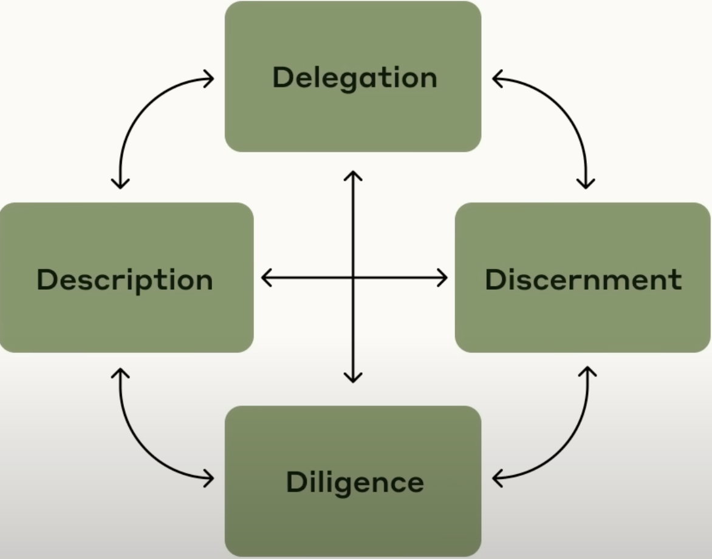

# AI Fluency Framework

## Why do we need AI Fluency?
AI influency isn't just about being a technical expert or memorizing the 10 best prompts whatever trending task is popular this month.
It's about developing a collection of practical skills, knowledge, insights, and values that reinforce each other.

This chapter explores what it really means to be "fluent" with AI and why this matters. We discuss how AI Fluency involves developing practical skills, knowledge, insights, and values that help you interact with AI systems in ways that are effective, efficient, ethical, and safe. We also introduce three ways people engage with AI:

- Automation: The AI completes specific tasks based on your instructions.
- Augmentation: You and AI collaborate as creative thinking and task execution partners.
- Agency: You configure AI to work independently on your behalf, establishing its knowledge and behavior patterns rather than just giving it specific tasks.

## The 4D Framework
The AI Fluency Framework consists of four core competencies (the 4Ds): 
Delegation: Deciding what work to do with AI vs. yourself 
Description: Communicating effectively with AI systems 
Discernment: Evaluating AI outputs critically 
Diligence: Ensuring responsible AI collaboration 

	

### 1) Delegation
Understand your goal and the problem that you are trying to solve 
Know what AI systems can and can't do 
Decide how to divide the work between you and the AI
### 2) Description
What you want the final output to be 
How you want the AI to approach the task 
How you want the AI to behave 
### 3) Discernment
Is the output useful and correct? 
Is the AI taking the right approach? 
Is the AI behaving as desired?
### 4) Diligence
Ensuring accuracy and taking responsibility 
Honesty and transparency 
Ethical use and critical awareness

